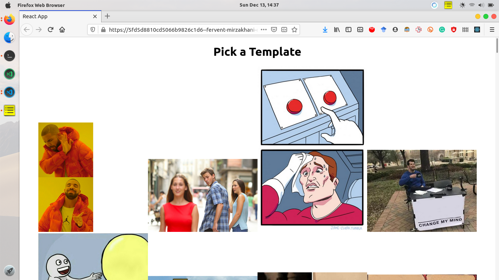
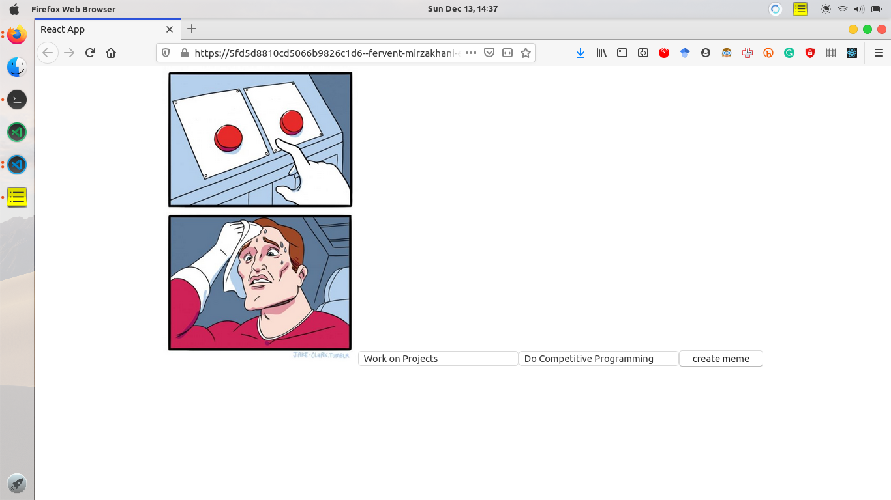
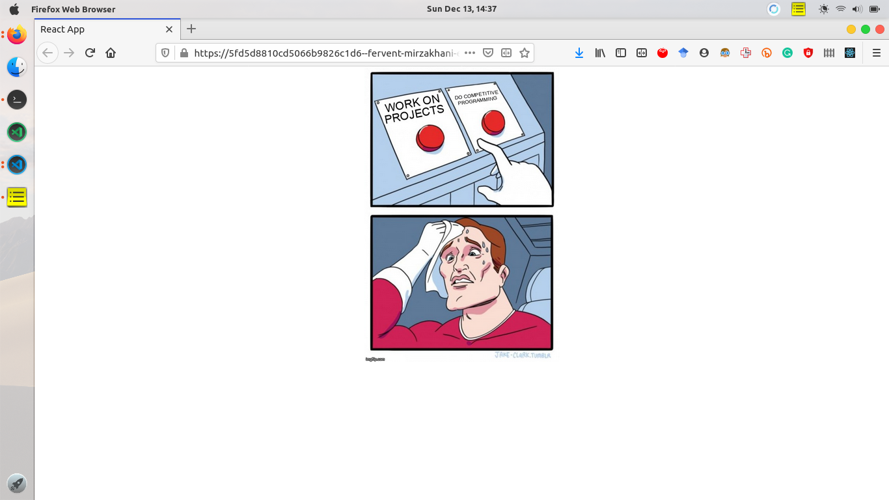

# Meme Generator

You can find the live site here -> https://fervent-mirzakhani-e77be5.netlify.app/

# Project Screenshots 

 

  <figure>
   
<h3>1. Home Screen</h3>

   
  </figure> 
 

 
 

  <figure>
   
<h3>2. Providing Top and Bottom Text for meme</h3>

   
  </figure> 
 

 

  <figure>
   
<h3>3. Meme Generated</h3>

   
  </figure> 
 

## To run the Project

1. Clone the projects and change directory to the project folder.
2. Install the node modules `npm install`.
3. Run `yarn start`.

## Additional Commands

In the project directory, you can run:

### `yarn start`

Runs the app in the development mode.\
Open [http://localhost:3000](http://localhost:3000) to view it in the browser.

The page will reload if you make edits.\
You will also see any lint errors in the console.

### `yarn test`

Launches the test runner in the interactive watch mode.\
See the section about [running tests](https://facebook.github.io/create-react-app/docs/running-tests) for more information.

### `yarn build`

Builds the app for production to the `build` folder.\
It correctly bundles React in production mode and optimizes the build for the best performance.

The build is minified and the filenames include the hashes.\
Your app is ready to be deployed!

See the section about [deployment](https://facebook.github.io/create-react-app/docs/deployment) for more information.

